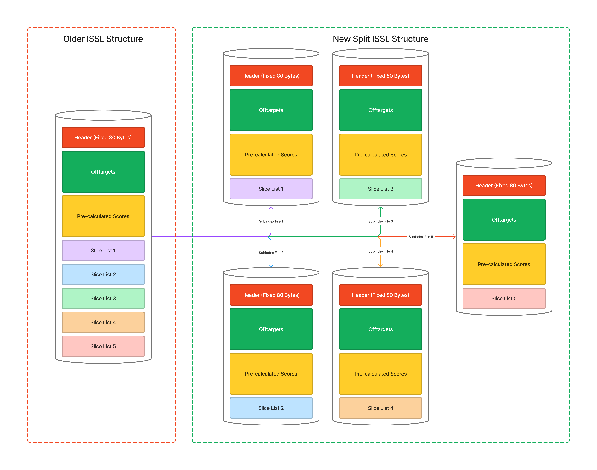
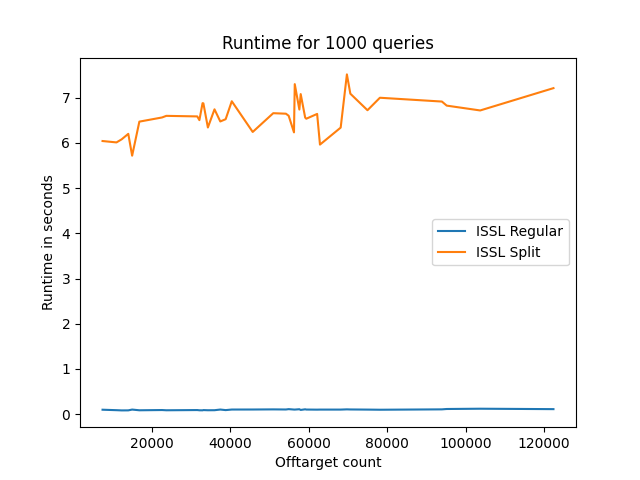
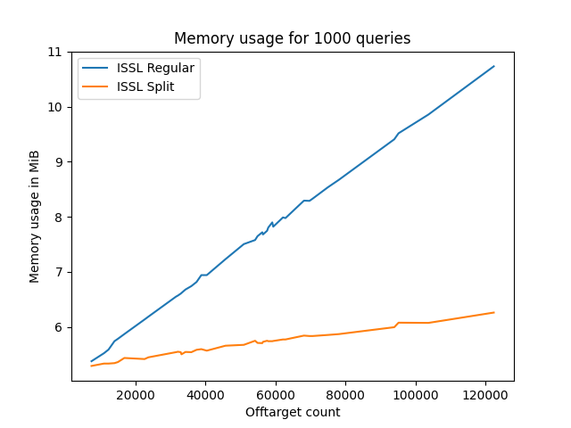

# Crackling

## Rapid Whole-Genome Identification of High Quality CRISPR Guide RNAs with the Crackling Method

Jacob Bradford, Timothy Chappell, and Dimitri Perrin. The CRISPR Journal. Jun 2022.410-421. <http://doi.org/10.1089/crispr.2021.0102>

## Preamble

> The design of CRISPR-Cas9 guide RNAs is not trivial and is a computationally demanding task. Design tools need to identify target sequences that will maximize the likelihood of obtaining the desired cut, while minimizing off-target risk. There is a need for a tool that can meet both objectives while remaining practical to use on large genomes.
>
> In this study, we present Crackling, a new method that is more suitable for meeting these objectives. We test its performance on 12 genomes and on data from validation studies. Crackling maximizes guide efficiency by combining multiple scoring approaches. On experimental data, the guides it selects are better than those selected by others. It also incorporates Inverted Signature Slice Lists (ISSL) for faster off-target scoring. ISSL provides a gain of an order of magnitude in speed compared with other popular tools, such as Cas-OFFinder, Crisflash, and FlashFry, while preserving the same level of accuracy. Overall, this makes Crackling a faster and better method to design guide RNAs at scale.
>
> Crackling is available at <https://github.com/bmds-lab/Crackling> under the Berkeley Software Distribution (BSD) 3-Clause license.

## Introduction

CRISPR (Clustered Regularly Interspaced Short Palindromic Repeats) is a technology that research scientists use to selectively modify the DNA of living organisms

Off-target effects in CRISPR/Cas9 gene editing refer to the deposition of unexpected, unwanted, or even adverse alterations to the genome. These effects occur when Cas9 acts on unintended genomic sites and creates cleavages which may cause genomic instability and disrupt the functionality of genes and may lead to adverse outcomes.

To prevent this, several software tools available that can emulate or score genome off-target risks in gene editing, however, these proved to be time-consuming and computationally expensive, especially for simple projects.

Therefore, to ensure portability and efficiency across different platforms and operating systems, and for implementing this in AWS server for cloud availability for researchers across the world, a new method for offtarget scoring was discovered, Inverted Signature Slice Lists (ISSL) for faster off-target scoring.

ISSL provides a gain of an order of magnitude in speed compared with other popular tools, such as Cas-OFFinder, Crisflash, and FlashFry, while preserving the same level of accuracy.

However, there was a limitation to ISSL, as it required relatively high memory requirement. This is where this project comes in. This project brings changes to improve upon the structure of ISSL while retaining both its behavioral and informational semantics.

## Structure



I would imagine ISSL as a dictionary, with each word being an offtarget. Previously we used to memorize the dictionary and directly load it to our memory, however, this proved to be demanding. With the new method of splitting the dictionary to multiple booklets, read the booklets sequentially, effectively this means that we only need to remember parts of the dictionary at a time.

## Dependencies

- The original cracking project to isolate offtargets, other than that, no dependencies, Yay!

## Compilation

```bash
g++.exe -g ./src/CreateSplitIndex.cpp -o ./bin/CreateSplitIndex.exe -O3
```

```bash
g++.exe -g ./src/ReadSplitIndex.cpp -o ./bin/ReadSplitIndex.exe -I ./include -O3
```

- Requires the POSIX threads library for Linux environments, add the `-pthreads` argument to `g++` if not compiling.
- Make sure you set the include path to `./include`.

## Usage

For reading and scoring `.issl` files.

```bash
[EXECUTABLE_PATH] [CANDIDATE_GUIDE_PATH] [MAXIMUM_DISTANCE] [SCORE_THRESHOLD] [ISSL_TABLE]
```

Example usage:

```bash
.src/ReadSplitIndex.exe ./test/issl/guides/CG20-100.txt 4 0 and ./test/issl/GCA_000008365.0.issl ./test/issl/GCA_000008365.1.issl ./test/issl/GCA_000008365.2.issl ./test/issl/GCA_000008365.3.issl ./test/issl/GCA_000008365.4.issl         
```

## Performance



Since this solution heavily depend on file IO, the runtime of the solution is heavily dependent on the number of queries and offtarget count, showing linear trend, the following graph shows the trend for offtargets for fixed query size. The solution is "blazingly fast", given O(1) lookup time for each query.



Memory usage is, as expected significantly reduced, making it "economically nimble".

## Future

New method to store offset to different slices in the slice-list, and load the slices to memory as needed for each query. In theory, this would reduce the maximum memory usage of loading slice-lists by 98%, and should increase performance, by reducing IO bound operations.

However, this must be tested, as this process would IO queries are done at different points of time (May be somewhat hard on HDD drives, but who uses HDD anyways? cloud providers do), which means compiler and operating system optimizations are scarce.

## Maybe

Multithreading for IO concurrency?
